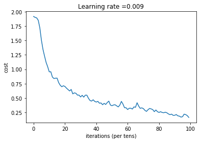

# Hand-Sign-Detection-using-CNN
Hand Signs corresponding to digits 0 to 5 are detected using CNN . The programs are being written in Tensorflow

The basic objective of this project is to train our computers to understand sign languages. The images contain 5 different types of signs from 0 to 5 using hand gestures. The images below represent better understanding of the sign languages that are to be detected by the computer by training using CNN

Each images are of 64 by 64 pixels and in RGB format.
The training set consists of 1080 images while the testing set consist of 120 images.

The images are trained using CNN and the forward propagation uses the following module to train its parameters

CONV2D -> RELU -> MAXPOOL -> CONV2D -> RELU -> MAXPOOL -> FLATTEN -> FULLYCONNECTED

In detail, we will use the following parameters for all the steps:

 - Conv2D: stride 1, padding is "SAME"
 - ReLU
 - Max pool: Use an 8 by 8 filter size and an 8 by 8 stride, padding is "SAME"
 - Conv2D: stride 1, padding is "SAME"
 - ReLU
 - Max pool: Use a 4 by 4 filter size and a 4 by 4 stride, padding is "SAME"
 - Flatten the previous output.
 - FULLYCONNECTED (FC) layer: Apply a fully connected layer without an non-linear activation function
 
 
 We train our model for 100 epochs and following is the loss that gets minismised after 100 epochs. The diagram is shown below for the reference
 
 
 The training and testing error are shown below
 
Train Accuracy: 0.940741
Test Accuracy: 0.783333
 
 We have succesfully built a model that recognizes SIGN language with almost 80% accuracy on the test set. 
 
