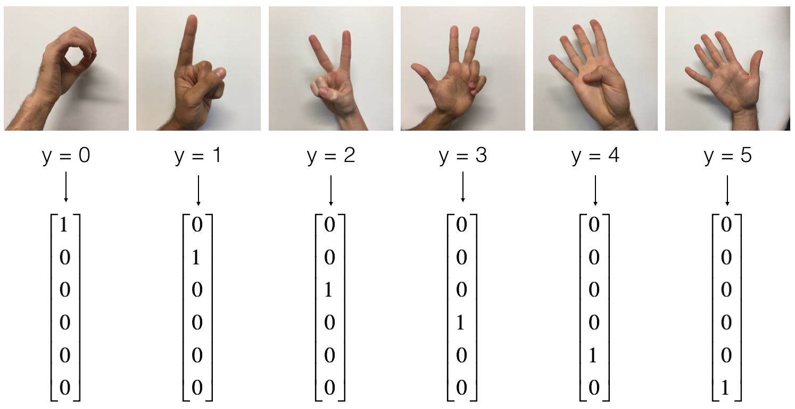

# Hand-Sign-Detection-using-CNN
Hand Signs corresponding to digits 0 to 5 are detected using CNN . The programs are being written in Tensorflow

The basic objective of this project is to train our computers to understand sign languages. The images contain 5 different types of signs from 0 to 5 using hand gestures. The images below represent better understanding of the sign languages that are to be detected by the computer by training using CNN

Each images are of 64 by 64 pixels and in RGB format.
The training set consists of 1080 images while the testing set consist of 120 images.

The images are trained using CNN and the forward propagation uses the following module to train its parameters

CONV2D -> RELU -> MAXPOOL -> CONV2D -> RELU -> MAXPOOL -> FLATTEN -> FULLYCONNECTED

The entire project has been explained in detail in the python notebook HandSignCnn.ipynb \

Dataset used: Signs \
Language : Python \
Packages : sklearn , matplotlib , tensorflow

Type of Problem: Classification using CNN (Supervised learning) \ 

Model used:
CNN
